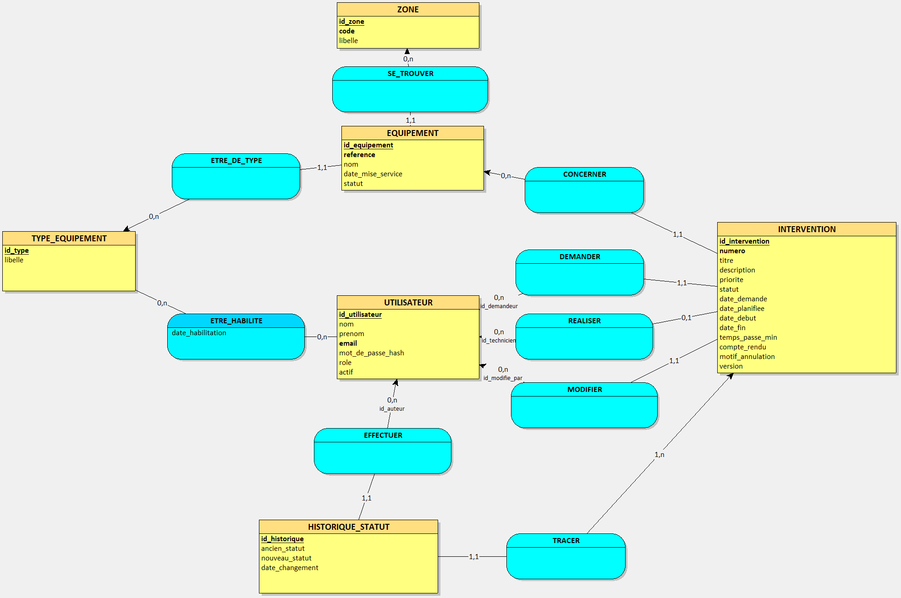
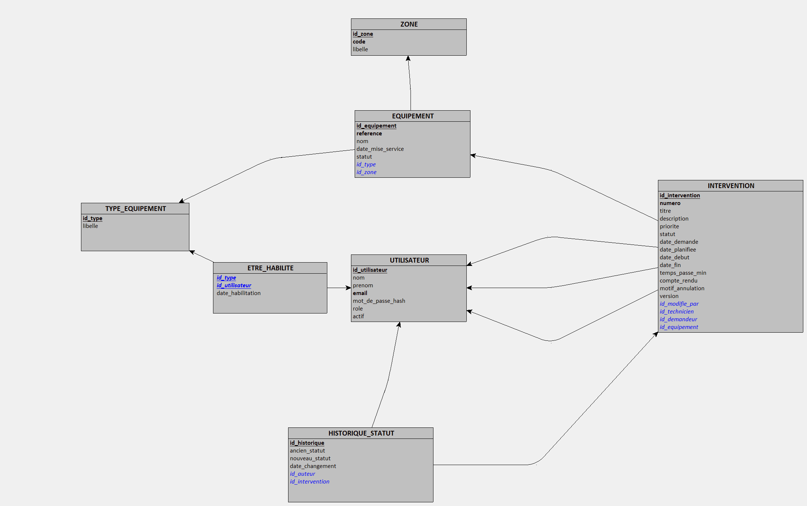

# MécaTrack
 

 
Application de suivi de maintenance industrielle : déclaration des pannes, planification des interventions et pilotage du parc d'équipements.
 
> 🚧 Projet en cours de développement : Sprint 1 terminé (authentification), Sprint 2 en préparation (référentiel des équipements).
 
## Stack technique
 
| Couche | Technologies |
| --- | --- |
| Back-end | Java 25 (LTS), Spring Boot 4, Spring Data JPA / Hibernate, Spring Security (JWT) |
| Base de données | Oracle Database Free, Flyway, PL/SQL |
| Front-end | Angular 21 (standalone, signals), Angular Material, RxJS |
| Contrat d'API | OpenAPI 3 en contract-first, avec génération des interfaces Spring et du client Angular |
| Tests | JUnit 5, AssertJ, Mockito, Testcontainers (Oracle), Vitest |
| DevOps | Docker Compose, GitHub Actions |
 
## Points clés
 
- **Contract-first** : le fichier [`api/openapi.yaml`](api/openapi.yaml) est la source de vérité de l'API. Les interfaces Spring et le client Angular sont générés à chaque build : une incompatibilité entre le back et le front est détectée à la compilation.
- **Règles métier garanties par la base** : contraintes nommées et `CHECK` Oracle (une intervention terminée a obligatoirement un compte rendu, une intervention annulée un motif…).
- **Sécurité** : API sans état, JWT signé via le support natif de Spring Security, autorisations par rôle, erreurs au format Problem Details (RFC 9457).
- **Tests sur une vraie base Oracle** grâce à Testcontainers, en local comme dans la CI. Développement des règles métier en TDD.

## Modélisation

Modèle conceptuel (méthode Merise, réalisé avec Looping) :



Modèle logique :



La [documentation technique complète](docs/MecaTrack_Documentation_technique.pdf) détaille la vision produit, l'architecture, les cas d'usage base de données et le découpage en sprints.

## Lancer le projet en local
 
### Prérequis
 
- Java 25
- Node.js (version LTS)
- Docker Desktop
### 1. La base de données
 
À la racine du projet, copier `.env.example` en `.env` et renseigner les valeurs, puis :
 
```bash
docker compose up -d
```
 
### 2. L'API
 
```bash
cd backend
mvn spring-boot:run "-Dspring-boot.run.profiles=demo"
```
 
L'API démarre sur http://localhost:8080. Le profil `demo` crée les comptes de démonstration. La documentation interactive est disponible sur http://localhost:8080/swagger-ui.html.
 
### 3. Le front-end
 
```bash
cd frontend
npm install
npm run generate:api
npm start
```
 
L'application est disponible sur http://localhost:4200.
 
### Comptes de démonstration
 
| Rôle | Email | Mot de passe |
| --- | --- | --- |
| Responsable maintenance | admin@mecatrack.fr | Demo2026! |
| Technicien | technicien@mecatrack.fr | Demo2026! |
| Demandeur | demandeur@mecatrack.fr | Demo2026! |
 
Ces comptes n'existent qu'avec le profil `demo`.
 
## Tests
 
```bash
# Back-end (Docker doit être lancé pour Testcontainers)
cd backend
mvn test
 
# Front-end
cd frontend
npx ng test --watch=false
```
 
## Avancement
 
| Sprint | Contenu | Statut |
| --- | --- | --- |
| 0 | Modélisation, setup, contrat OpenAPI, CI | ✅ Terminé |
| 1 | Authentification JWT, rôles, page de connexion | ✅ Terminé |
| 2 | Référentiel des équipements | ⏳ À venir |
| 3 | Interventions et cycle de vie (TDD) | ⏳ À venir |
| 4 | Oracle avancé : reporting, index, PL/SQL, performance | ⏳ À venir |
| 5 | Tableau de bord, export, sécurité, déploiement sur Oracle Cloud | ⏳ À venir |
 
## Auteur
 
**Mathieu Fenouil**, développeur full-stack Java / Angular
[LinkedIn](https://www.linkedin.com/in/mathieu-fenouil-développeur-full-stack/) · [GitHub](https://github.com/Matfen2)
